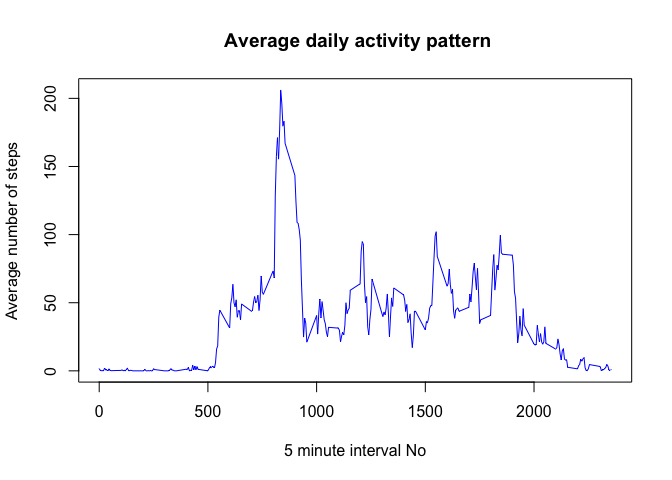
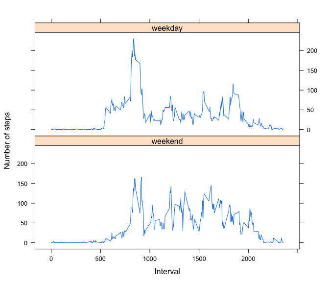

# Reproducible Research: Peer Assessment 1

## Loading and preprocessing the data

```r
unzip(zipfile="./activity.zip")

adata <- read.csv("activity.csv",
                  colClasses = c("integer","Date","integer"),
                  header = TRUE,
                  na.strings = "NA"
                  )
```

## What is mean total number of steps taken per day?

```r
steps_per_day <- aggregate(steps ~ date,adata,sum)

colnames(steps_per_day) <- c("Date","Steps")

steps_per_day
```

```
##          Date Steps
## 1  2012-10-02   126
## 2  2012-10-03 11352
## 3  2012-10-04 12116
## 4  2012-10-05 13294
## 5  2012-10-06 15420
## 6  2012-10-07 11015
## 7  2012-10-09 12811
## 8  2012-10-10  9900
## 9  2012-10-11 10304
## 10 2012-10-12 17382
## 11 2012-10-13 12426
## 12 2012-10-14 15098
## 13 2012-10-15 10139
## 14 2012-10-16 15084
## 15 2012-10-17 13452
## 16 2012-10-18 10056
## 17 2012-10-19 11829
## 18 2012-10-20 10395
## 19 2012-10-21  8821
## 20 2012-10-22 13460
## 21 2012-10-23  8918
## 22 2012-10-24  8355
## 23 2012-10-25  2492
## 24 2012-10-26  6778
## 25 2012-10-27 10119
## 26 2012-10-28 11458
## 27 2012-10-29  5018
## 28 2012-10-30  9819
## 29 2012-10-31 15414
## 30 2012-11-02 10600
## 31 2012-11-03 10571
## 32 2012-11-05 10439
## 33 2012-11-06  8334
## 34 2012-11-07 12883
## 35 2012-11-08  3219
## 36 2012-11-11 12608
## 37 2012-11-12 10765
## 38 2012-11-13  7336
## 39 2012-11-15    41
## 40 2012-11-16  5441
## 41 2012-11-17 14339
## 42 2012-11-18 15110
## 43 2012-11-19  8841
## 44 2012-11-20  4472
## 45 2012-11-21 12787
## 46 2012-11-22 20427
## 47 2012-11-23 21194
## 48 2012-11-24 14478
## 49 2012-11-25 11834
## 50 2012-11-26 11162
## 51 2012-11-27 13646
## 52 2012-11-28 10183
## 53 2012-11-29  7047
```

```r
hist(x = steps_per_day$Steps,
     main = "Histogram of the total number of steps taken each day", 
     xlab="Daily steps"
     )
```

<!-- -->


```
##     Mean   Median 
## 10766.19 10765.00
```

## What is the average daily activity pattern?


```r
y <- tapply(adata$steps, 
            adata$interval, 
            mean, 
            na.rm = TRUE
            )
plot(
        x = names(y),
        y = tapply(adata$steps, adata$interval, mean, na.rm = TRUE),
        type="l", 
        col="blue",
        main=" Average daily activity pattern", 
        xlab="5 minute interval No", 
        ylab="Average number of steps"
        )
```

<!-- -->

###5-minute interval, on average across all the days in the dataset, contains the maximum number of steps

Average intetval steps maximum

```r
avg_max_steps <- max(y)
avg_max_steps
```

```
## [1] 206.1698
```
Corresponding interval No 

```r
names(y[which(y==avg_max_steps)])
```

```
## [1] "835"
```

## Imputing missing values

Total number of NAs

```r
sum(is.na(adata$steps))
```

```
## [1] 2304
```

Filling in all of the missing values in dataset **adata**
(subsetting by the mean for that 5-minute interval) and creating new dataset **adata_n**

```r
adata_n <- adata
for (rn in 1:nrow(adata_n)) {
        if (is.na(adata_n[rn, "steps"])) {
                adata_n[rn, "steps"] <- y[as.character(adata_n[rn, "interval"])]
        }
}
```
Now there is no NA at all.

```r
sum(is.na(adata_n$steps))
```

```
## [1] 0
```


```r
steps_per_day_n <- aggregate(steps ~ date,adata_n,sum)
hist(steps_per_day$Steps,main = "Histogram of the total number of steps taken each day (NAs replaced)", xlab="Daily steps")
```

<!-- -->

The histogram is slightly changed, but average numbers (the Mean and Median) remained the same for the chosen strategy of NA replacement.


```
##     Mean   Median 
## 10766.19 10765.00
```

## Are there differences in activity patterns between weekdays and weekends?

Extending dataset **adata_n** with a new fiels wDay, wich contains a factor value, indicating is that day a weekday or a weekend.

```r
bizdays <- c('Monday', 'Tuesday', 'Wednesday', 'Thursday', 'Friday')
adata_n$wDay <- factor(
        (weekdays(adata_n$date) %in% bizdays), 
        levels=c(FALSE, TRUE), 
        labels=c('weekend', 'weekday')
        ) 
```

Panel plot of the 5-minute intervaland the average number of steps taken, averaged across all weekday days or weekend days.

```r
library(lattice)

avg_steps_per_day_n <- aggregate(steps ~ interval + wDay,adata_n,mean)
names(avg_steps_per_day_n) <- c("interval","wDay","steps")

xyplot(steps ~ interval | wDay,
       avg_steps_per_day_n, 
       type = "l",
       layout = c(1, 2),
       xlab = "Interval",
       ylab = "Number of steps"
       )
```

<!-- -->

There is an obvious difference in activity level, which is noticeably lower in the middle of the day on weekdays compared to the weekend.
